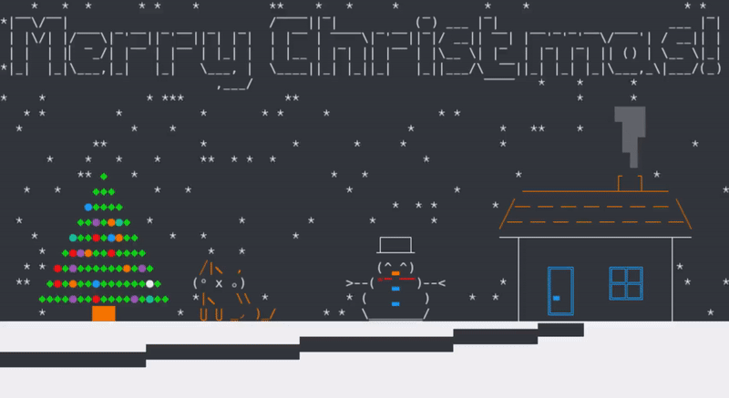

# Christmas greetings console animation

## Description
Christmas greetings console animation written in Python. Unicode characters are used in the animation
to draw snowfall, a Christmas tree with glowing lights, a cat near the tree:D, a snowman and a 
smoking house. What a cozy winter scenery!

## Animation


## Getting Started
Download the source code:
```bash
git clone https://github.com/roman1e2f5p8s/xmas
```
No dependency installation is required.

## Usage
Simply run in your terminal
```bash
python xmas.py
```
Enjoy and have fun!

## Built With
The Python 3.9 Standard Library is only used.
* [Curses](https://docs.python.org/3/howto/curses.html)

## Author
* **Roman Overko**

## Contributing
Pull requests are welcome. For major changes, please open an issue first to discuss what you would 
like to change.

## License
None
